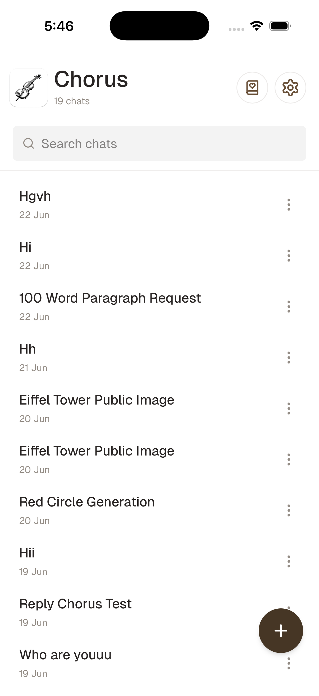
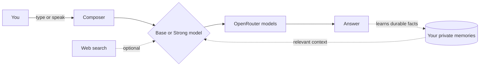
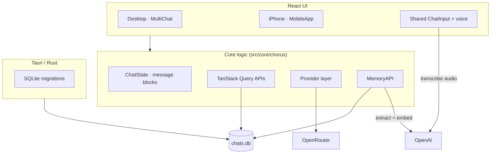
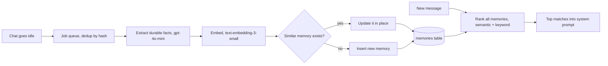

<p align="center">
  
</p>

<h1 align="center">Chorus for iPhone</h1>

<p align="center"><b>Chat with every AI model from one app, with a private memory and your voice.</b></p>

<p align="center">
  
</p>

---

## What this is

Chorus for iPhone is a native iOS app for talking to many AI models through a single, simple chat. You bring your own API key, pick the models you like, and chat. The app remembers useful things about you across conversations, lets you speak instead of type, and keeps your data on your device.

It is built for people who want one clean place to use the best models without juggling many apps or paying for many subscriptions.

## What you can do

- **Chat with top models** through OpenRouter. Set a fast **Base** model and a more capable **Strong** model, and flip between them in any chat with one tap.
- **Speak instead of type.** Tap the mic in the composer, talk, and your words appear in the box. Transcription uses OpenAI and is tuned for accuracy, including accented English.
- **A memory that actually remembers you.** The app quietly learns durable facts about you, your projects, your preferences and your stack, then brings the relevant ones into new chats. You can say "remember that…" to save something on purpose, and you can view or delete every memory.
- **Search the web** when you want fresh answers, with a simple per-app toggle.
- **Stay organized.** Pin important chats, search your history, and export any conversation to JSON or Markdown.
- **Move fast.** Swipe left to right anywhere to open your chat list, and reach settings grouped into clean, tappable categories.
- **Make it yours.** Add a personal system prompt, and pick a light, dark, or system theme.
- **Private by default.** Your chats and memories live in a local database on your device. Your keys are yours.

## How it works



You write or speak a message. The app pulls in any memories that are relevant to what you asked, sends everything to your chosen model through OpenRouter, and streams the answer back. When a chat winds down, the app reviews it and saves anything worth remembering for next time.

## Screens

| Your chats | |
| --- | --- |
|  | Search, pin, and open past conversations. Swipe in from the left from anywhere to bring this list up. |

## Credit

Chorus for iPhone is built on the open-source [Chorus](https://github.com/meltylabs/chorus) desktop app by Melty Labs. This repository is an independent fork that adds the iPhone app, the on-device memory layer, voice input, and the other features described below. Thank you to the Chorus team for the foundation.

---

# How it is built

## Stack

- **UI:** React, TypeScript, TanStack Query
- **Shell:** Tauri (a Rust core with a web UI), targeting macOS and iOS
- **Storage:** local SQLite (`chats.db`), with schema migrations in Rust
- **Models:** OpenRouter for chat, OpenAI for memory and voice

## Architecture



The same React codebase serves both desktop and iPhone. A small platform check (`src/ui/lib/platform.ts`) routes the iPhone into `MobileApp.tsx`, while both share one composer (`ChatInput.tsx`). Every model resolves through a thin provider interface (`IProvider.streamResponse`), so chat, memory, and voice all flow through clear, swappable seams.

## The memory layer

This is the part that makes the app feel like it knows you. It is private: memories never leave your device except as the single OpenAI request needed to extract or find them.



How each piece works:

- **Learning.** When a chat goes idle, a queued job reads the conversation (your messages and the chosen replies) and asks `gpt-4o-mini`, with a memory-manager prompt, to return durable facts about you: identity, preferences, projects, goals, and stack. It is generous about real context and strict about ignoring throwaway detail.
- **Embedding.** Each memory is embedded with `text-embedding-3-small` (256 dimensions) so it can be matched by meaning, not just keywords. Embeddings cost about $0.02 per million tokens, effectively free in practice.
- **De-duplication.** Before saving, a new fact is compared by embedding similarity to what you already have. If it is essentially the same, the existing memory is updated in place, so memories evolve instead of piling up duplicates.
- **Recall.** On each new message, every memory is ranked against it with a hybrid of embedding similarity and keyword overlap, and the top matches are added to the model's system prompt.
- **Durability.** A jobs table with transcript hashing avoids redundant work, and tombstones make sure a memory you delete is not silently relearned.

## Voice input

The composer records with the browser `MediaRecorder` API, picks an audio format the platform supports (mp4 on iOS, webm on desktop), and sends one multipart request to OpenAI `gpt-4o-transcribe` with an English hint for accuracy. The transcript is dropped straight into the draft. A 15 second clip costs roughly a third of a cent.

## Models on mobile

Instead of the desktop model picker, the iPhone uses two slots, **Base** and **Strong**, stored per chat. New chats start on Base; one toggle promotes a chat to Strong when you need more power. Model preferences and the per-chat choice are kept in app metadata.

## Other features

- **Pin, export, and search** for conversations, in `ChatAPI` and `ExportAPI`.
- **Edge swipe** to open the chat list, and **collapsible settings** categories, in `MobileApp.tsx`.
- **Production builds** strip debug logging for a quieter, slightly faster runtime.

---

# Development

### Requirements

Node.js 22+, pnpm, Rust and Cargo, Xcode (for iOS), and Git LFS.

### Install

```bash
git lfs install --force
git lfs pull
pnpm install
pnpm run setup
```

### Run

```bash
pnpm run dev                                          # macOS app
VITE_CHORUS_MOBILE=1 pnpm tauri ios dev "iPhone 17"   # iPhone simulator
```

### Build a sideloadable iPhone app

```bash
./script/build-unsigned-ipa.sh
```

This produces `Chorus-unsigned.ipa` at the repo root. It is self-contained (no dev server needed) and unsigned, so Sideloadly or AltStore can sign it with your Apple ID. Set `OUT_IPA` to choose the output path.

### Checks

```bash
pnpm run build && pnpm run lint && pnpm run test
```

## Configuration

Add provider keys in the app's settings. The iPhone app uses **OpenRouter** for chat and **OpenAI** for the optional memory and voice features. Keys are stored on your device.

## License

Available under the [MIT License](LICENSE).
